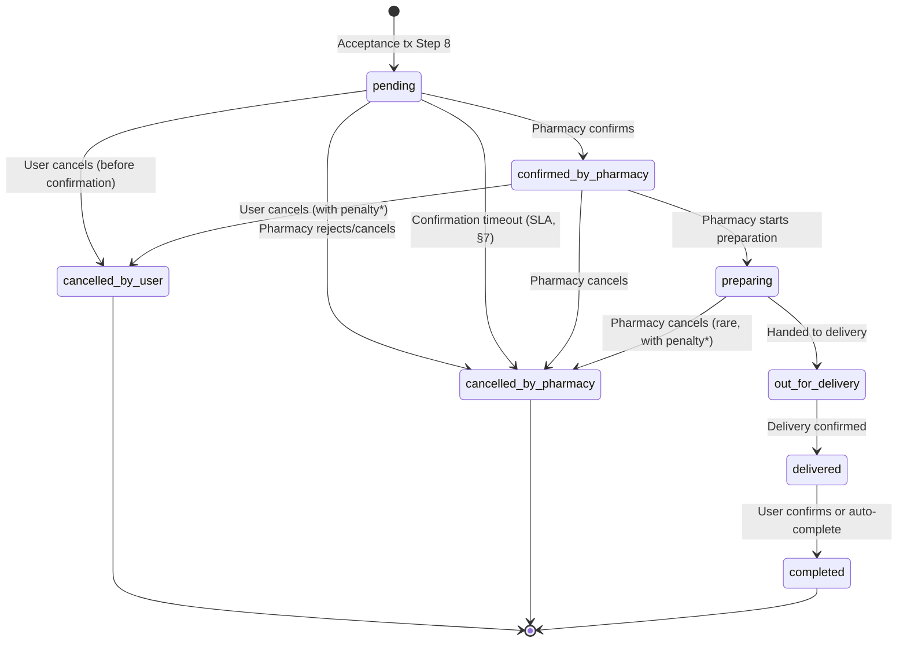

# Order Lifecycle & Post-Accept Flow — Specification

> **Status**: v2 — Final (Revised per Architectural Feedback)  
> **Layer**: 4 (Order Management)  
> **Depends on**: Layer 2 (requests, offers, pharmacies, users), Acceptance Spec v2

---

## 1. Purpose

This specification defines the full lifecycle of an order from the moment a user accepts an offer through delivery, completion, and cancellation paths. It covers schema design, state machine transitions, cancellation governance, commission recording, SLA enforcement, and invariant guarantees.

---

## 2. Order Creation — When and How

### 2.1 Decision: Order Created Inside Acceptance Transaction

The order row must be inserted as **Step 8** inside the existing acceptance transaction (Acceptance Spec v2 §2.3). This is not a separate step.

**Rationale:**

- **Atomicity**: If acceptance succeeds but order insertion fails independently, we have an accepted offer with no order — a broken state.
- **Zero-gap guarantee**: There is never a window where `request.state = 'accepted'` but no `orders` row exists.
- **Simplicity**: One transaction, one result set, one recovery path.

### 2.2 Extended Acceptance Transaction (8 Steps)

The existing 7-step transaction gains one additional step:

```sql
-- ... Steps 1-7 unchanged (Acceptance Spec v2 §2.3) ...

-- Step 8: Create order from accepted offer
INSERT INTO orders (
    id, request_id, offer_id, pharmacy_id, user_id,
    total_price, delivery_fee,
    commission_rate, commission_amount,
    status, created_at, updated_at
)
SELECT
    gen_random_uuid(),
    o.request_id,
    o.id,
    o.pharmacy_id,
    r.user_id,
    o.total_price,
    o.delivery_fee,
    $commissionRate,
    o.total_price * $commissionRate / 100,
    'pending',
    now(),
    now()
FROM offers o
JOIN requests r ON r.id = o.request_id
WHERE o.id = $offerId
RETURNING id;

COMMIT;
```

### 2.3 Lock Order Unchanged

The deadlock-prevention rule remains: lock `requests` first, then `offers`. The `INSERT INTO orders` creates a new row (no locking conflict), so no additional lock ordering is needed.

---

## 3. Orders Schema

### 3.1 Table Definition

| Column | Type | Constraints | Notes |
|--------|------|------------|-------|
| `id` | `UUID` | PK, DEFAULT `gen_random_uuid()` | |
| `request_id` | `UUID` | NOT NULL, FK → `requests(id)`, UNIQUE | One order per request |
| `offer_id` | `UUID` | NOT NULL, FK → `offers(id)`, UNIQUE | One order per offer |
| `pharmacy_id` | `UUID` | NOT NULL, FK → `pharmacies(id)` | Denormalized for query performance |
| `user_id` | `UUID` | FK → `users(id)`, NULLABLE | Matches `requests.user_id` (may be anonymous) |
| `total_price` | `NUMERIC(10,2)` | NOT NULL | Copied from accepted offer |
| `delivery_fee` | `NUMERIC(10,2)` | NOT NULL, DEFAULT 0 | Copied from accepted offer |
| `commission_rate` | `NUMERIC(5,2)` | NOT NULL | Platform percentage at time of acceptance |
| `commission_amount` | `NUMERIC(10,2)` | NOT NULL | `total_price * commission_rate / 100` (excludes `delivery_fee`) |
| `commission_status` | `commission_status_enum` | NOT NULL, DEFAULT `'pending'` | See §6.4 |
| `status` | `order_status_enum` | NOT NULL, DEFAULT `'pending'` | See §4 |
| `pharmacy_confirmed_at` | `TIMESTAMPTZ` | NULLABLE | Set when pharmacy confirms |
| `estimated_prep_minutes` | `INTEGER` | NULLABLE | Set by pharmacy on confirmation |
| `delivered_at` | `TIMESTAMPTZ` | NULLABLE | Set on delivery |
| `completed_at` | `TIMESTAMPTZ` | NULLABLE | Set on completion |
| `cancelled_at` | `TIMESTAMPTZ` | NULLABLE | Set on cancellation |
| `cancellation_reason` | `TEXT` | NULLABLE | Reason for cancellation |
| `cancelled_by` | `VARCHAR(20)` | NULLABLE | 'user', 'pharmacy', or 'system' |
| `created_at` | `TIMESTAMPTZ` | NOT NULL, DEFAULT `now()` | Audit |
| `updated_at` | `TIMESTAMPTZ` | NOT NULL, DEFAULT `now()` | Audit |

### 3.2 Indexes

| Index | Columns | Purpose |
|-------|---------|---------|
| PK | `id` | Primary key |
| UNIQUE | `request_id` | Invariant O-1: one order per request |
| UNIQUE | `offer_id` | Invariant O-3: one order per accepted offer |
| IDX | `pharmacy_id` | Pharmacy order lookup |
| IDX | `user_id` | User order history |
| IDX | `status` | Status-based queries |
| IDX | `created_at` | Chronological listing |

### 3.3 Enum: `order_status_enum`

```sql
CREATE TYPE order_status_enum AS ENUM (
    'pending',                 -- Order created, awaiting pharmacy confirmation
    'confirmed_by_pharmacy',   -- Pharmacy acknowledged and will prepare
    'preparing',               -- Pharmacy actively preparing the order
    'out_for_delivery',        -- Handed to delivery / ready for pickup
    'delivered',               -- Delivered to user
    'completed',               -- User confirmed receipt (or auto-complete after timeout)
    'cancelled_by_user',       -- User cancelled
    'cancelled_by_pharmacy'    -- Pharmacy cancelled
);
```

### 3.4 Enum: `commission_status_enum`

```sql
CREATE TYPE commission_status_enum AS ENUM (
    'pending',   -- Commission recorded at acceptance, not yet finalized
    'earned',    -- Order completed — commission is collected
    'voided'     -- Order cancelled — commission is not collected
);
```

| Order Event | `commission_status` Transition |
|-------------|-------------------------------|
| Acceptance (Step 8) | → `'pending'` |
| Order `completed` | → `'earned'` |
| Order `cancelled_by_user` | → `'voided'` |
| Order `cancelled_by_pharmacy` | → `'voided'` |

---

## 4. Order State Machine

### 4.1 Transition Diagram



### 4.2 Allowed Transitions (Strict)

| From | To | Actor | Condition |
|------|----|-------|-----------|
| `pending` | `confirmed_by_pharmacy` | Pharmacy | Pharmacy acknowledges order |
| `pending` | `cancelled_by_user` | User | Before pharmacy confirms |
| `pending` | `cancelled_by_pharmacy` | Pharmacy / System | Pharmacy rejects or confirmation timeout |
| `confirmed_by_pharmacy` | `preparing` | Pharmacy | Pharmacy begins preparation |
| `confirmed_by_pharmacy` | `cancelled_by_user` | User | Allowed with potential penalty (future) |
| `confirmed_by_pharmacy` | `cancelled_by_pharmacy` | Pharmacy | Pharmacy cancels (trust score impact) |
| `preparing` | `out_for_delivery` | Pharmacy | Order handed to delivery |
| `preparing` | `cancelled_by_pharmacy` | Pharmacy | Rare, with trust score impact |
| `out_for_delivery` | `delivered` | System / Delivery | Delivery confirmed |
| `delivered` | `completed` | User / System | User confirms or auto-complete timeout |

### 4.3 Terminal States

| State | Terminal? | Notes |
|-------|-----------|-------|
| `completed` | ✅ Yes | Happy path end |
| `cancelled_by_user` | ✅ Yes | User-initiated cancellation |
| `cancelled_by_pharmacy` | ✅ Yes | Pharmacy-initiated or system timeout |

### 4.4 Forbidden Transitions

The following transitions are **never allowed**:

- Any terminal state → any other state (no resurrection)
- `out_for_delivery` → `cancelled_by_user` (too late to cancel)
- `delivered` → `cancelled_by_*` (already delivered)
- Any state → `pending` (no backward transitions)
- Skipping states (e.g., `pending` → `out_for_delivery`)

---

## 5. Cancellation Rules

### 5.1 User Cancellation

| Order Status | User Can Cancel? | Side Effects |
|-------------|-----------------|--------------|
| `pending` | ✅ Yes, free | `request.state` remains `'accepted'` (the acceptance happened, offer was selected) |
| `confirmed_by_pharmacy` | ✅ Yes, with warning | Future: potential cancellation fee |
| `preparing` | ❌ No | Order is in progress |
| `out_for_delivery` | ❌ No | Order is en route |
| `delivered` | ❌ No | Already delivered |

### 5.2 Pharmacy Cancellation

| Order Status | Pharmacy Can Cancel? | Side Effects |
|-------------|---------------------|--------------|
| `pending` | ✅ Yes | Equivalent to rejection. Trust score impact. |
| `confirmed_by_pharmacy` | ✅ Yes, with penalty | Trust score reduction. User notified. |
| `preparing` | ✅ Yes, with severe penalty | Trust score significant reduction. User refunded. |
| `out_for_delivery` | ❌ No | Too late |
| `delivered` | ❌ No | Already delivered |

### 5.3 System Cancellation

The system may auto-cancel orders when:
- Pharmacy confirmation timeout expires (§7)
- Pharmacy account suspended during active order

### 5.4 Cancellation Impact on `request.state`

| Scenario | `request.state` Change |
|----------|----------------------|
| Order cancelled, no action needed | **Remains `'accepted'`** — the request lifecycle is complete |
| Future: re-selection feature | Would require new `request.state` value (out of scope) |

> [!NOTE]
> Cancellation does NOT revert `request.state` to `'fully_offered'` or `'partially_offered'`. The request lifecycle is separate from the order lifecycle. A cancelled order is an order-level event, not a routing event. Re-routing or re-selection (if ever needed) would be a new feature with its own spec.

---

## 6. Commission Model (Simple v1)

### 6.1 When Is Commission Recorded?

**At acceptance time (Step 8 of the acceptance transaction).**

| Approach | Decision | Rationale |
|----------|----------|-----------|
| Record at acceptance | ✅ **Selected** | Commission is a marketplace fee, not dependent on delivery. Pre-recording enables financial forecasting. |
| Record at completion | ❌ Rejected | Delays revenue recognition. Completed orders may take days. |
| Record at delivery | ❌ Rejected | Delivery confirmation may be unreliable. |

### 6.2 Commission Calculation

```
commission_amount = total_price × commission_rate / 100
```

> [!IMPORTANT]
> Commission is calculated on `total_price` **only**. `delivery_fee` is explicitly excluded from commission calculation. Delivery is a cost-center, not a marketplace transaction value.

| Parameter | Source | Default |
|-----------|--------|--------|
| `total_price` | From accepted `offers.total_price` | — |
| `delivery_fee` | **Excluded** from commission | — |
| `commission_rate` | Environment variable `COMMISSION_RATE_PERCENT` (v1 default: `10.00`) | 10.00 (10%) |

### 6.3 Commission Finality

| Order Outcome | Commission Status |
|--------------|------------------|
| `completed` | **Earned** — platform keeps commission |
| `cancelled_by_user` (before confirm) | **Voided** — no commission collected |
| `cancelled_by_user` (after confirm) | **Partially earned** — future: cancellation fee deducted from commission |
| `cancelled_by_pharmacy` | **Voided** — no commission. Pharmacy at fault. |

> [!IMPORTANT]
> Commission is recorded at acceptance with `commission_status = 'pending'`. On order completion, it transitions to `'earned'`. On any cancellation, it transitions to `'voided'`. The `commission_status` column provides formal financial state tracking without requiring a separate ledger table.

### 6.4 Commission Status Transitions

| `commission_status` | Trigger | SQL Guard |
|--------------------|---------|----------|
| `'pending'` | Order created (Step 8) | Default on INSERT |
| `'earned'` | `order.status → 'completed'` | `WHERE commission_status = 'pending'` |
| `'voided'` | `order.status → 'cancelled_by_*'` | `WHERE commission_status = 'pending'` |

---

## 7. SLA Tracking

### 7.1 Pharmacy Confirmation Timeout

| Parameter | Value | Configurable? |
|-----------|-------|---------------|
| `PHARMACY_CONFIRM_TIMEOUT_SEC` | 900 (15 minutes) | Yes (env variable) |

If a pharmacy does not transition the order from `pending` → `confirmed_by_pharmacy` within this window:

1. System auto-cancels the order (`cancelled_by_pharmacy`, reason: `'confirmation_timeout'`)
2. Pharmacy `trust_score` is penalized
3. User is notified

### 7.2 Implementation Approach (Phase 7 Scope)

SLA enforcement requires a background job or timer system. Options:

| Approach | Complexity | Decision |
|----------|-----------|----------|
| Polling sweep (like stale job recovery) | Low | ✅ **Selected — included in Phase 7** |
| pg_cron scheduled job | Medium | Future consideration |
| Event-driven with delay queue | High | Not yet needed |

The sweep runs on a configurable interval and queries:

```sql
SELECT id FROM orders
WHERE status = 'pending'
  AND created_at < now() - interval '$timeoutSec seconds'
FOR UPDATE SKIP LOCKED;
```

Then transition each to `cancelled_by_pharmacy` with reason `'confirmation_timeout'`.

### 7.3 Other SLA Timers (Future)

| SLA | Timeout | Trigger |
|-----|---------|---------|
| Preparation time | Configurable per pharmacy | `confirmed_by_pharmacy` → `preparing` |
| Delivery window | Configurable | `out_for_delivery` → `delivered` |
| Auto-complete | 24 hours after delivery | `delivered` → `completed` |

These are NOT implemented in Phase 7. Documented for future reference. Only the pharmacy confirmation timeout sweep is in Phase 7 scope.

---

## 8. Invariants

### 8.1 Order Invariants

| ID | Invariant | Enforcement |
|----|-----------|-------------|
| **O-1** | Exactly one order per accepted request | `UNIQUE(request_id)` on `orders` table |
| **O-2** | Order must reference an accepted offer | `UNIQUE(offer_id)` + application-level: only insert from accepted offer |
| **O-3** | No order without an accepted offer | Order created inside acceptance transaction — if offer isn't accepted, order isn't created |
| **O-4** | `orders.total_price` must match `offers.total_price` at creation | Copied from offer in Step 8 `SELECT ... FROM offers` |
| **O-5** | Commission is deterministic: `commission_amount = total_price × rate / 100` | Calculated in Step 8 INSERT |
| **O-6** | No backward transitions in order status | Application-level transition guards |
| **O-7** | Terminal states are permanent | `WHERE status NOT IN ('completed', 'cancelled_by_user', 'cancelled_by_pharmacy')` on all UPDATEs |
| **O-8** | `cancelled_by` must match cancellation actor | Application-level: route sets `cancelled_by` based on authenticated user type |
| **O-9** | If `request.state = 'accepted'`, exactly one `orders` row MUST exist for that request | `UNIQUE(request_id)` + atomic insertion in acceptance tx Step 8 |

### 8.2 Cross-Spec Invariant Alignment

| Parent Invariant | Order Invariant | Relationship |
|-----------------|----------------|--------------|
| A-1 (exactly one accepted offer) | O-2 (order references accepted offer) | One-to-one chain: request → offer → order |
| A-4 (`accepted` is terminal) | O-1 (one order per request) | `request.state = 'accepted'` guarantees exactly one order exists |
| A-7 (routing_jobs terminal) | — no order invariant needed | Orders have no relationship with routing_jobs |

---

## 9. Relationship with `routing_jobs`

**None.**

| Question | Answer |
|----------|--------|
| Does order creation modify `routing_jobs`? | No |
| Does order status affect `routing_jobs.status`? | No |
| Does order cancellation trigger re-routing? | No (future feature if needed) |
| Can `routing_jobs` affect order status? | No |

The routing lifecycle (`pending → active → completed`) and the order lifecycle (`pending → ... → completed`) are **completely independent** after the acceptance transaction. They share only the `request_id` as a common ancestor.

```
routing_jobs ──(request_id)──► requests ◄──(request_id)── orders
                                  │
                                  │  ← acceptance transaction is the bridge
                                  │     that converts routing output into
                                  │     order input (offers → order)
                                  ▼
                              offers ──(offer_id)──► orders
```

---

## 10. Implementation Impact

### 10.1 Required Changes

| Component | Change |
|-----------|--------|
| `migrations/` (new) | Create `orders` table + `order_status_enum` + `commission_status_enum` |
| `src/services/offerAcceptance.js` (modify) | Add Step 8 — order INSERT inside acceptance tx |
| `src/services/orderService.js` (new) | Order status transitions, cancellation logic, commission_status transitions |
| `src/routes/orders.js` (new) | Order CRUD endpoints |
| `src/workers/order-sla-sweep.js` (new) | Pharmacy confirmation timeout sweep |
| `tests/` (new) | Order lifecycle + SLA sweep tests |

### 10.2 No Changes Required

| Component | Reason |
|-----------|--------|
| `src/workers/routing-worker.js` | No routing changes |
| `src/services/offerSelection.js` | Selection is read-only |
| `src/routes/offers.js` (GET endpoint) | Unaffected |

---

## 11. Resolved Questions

| # | Question | Resolution |
|---|----------|------------|
| 1 | Commission rate configurable? | **Yes.** Via `COMMISSION_RATE_PERCENT` env variable, default `10.00`. |
| 2 | New `request.state` for post-cancellation? | **No.** `'accepted'` remains terminal. Order cancellation is order-level only. |
| 3 | SLA enforcement in Phase 7? | **Yes.** Pharmacy confirmation timeout sweep is included in Phase 7 scope. |
| 4 | `delivery_fee` in commission? | **No.** Commission on `total_price` only. Delivery fee explicitly excluded. |
